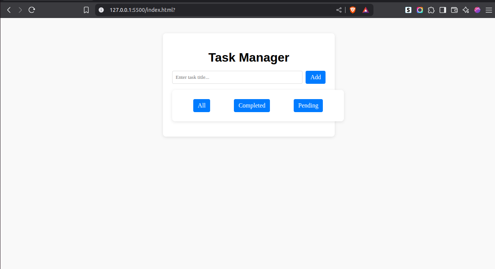
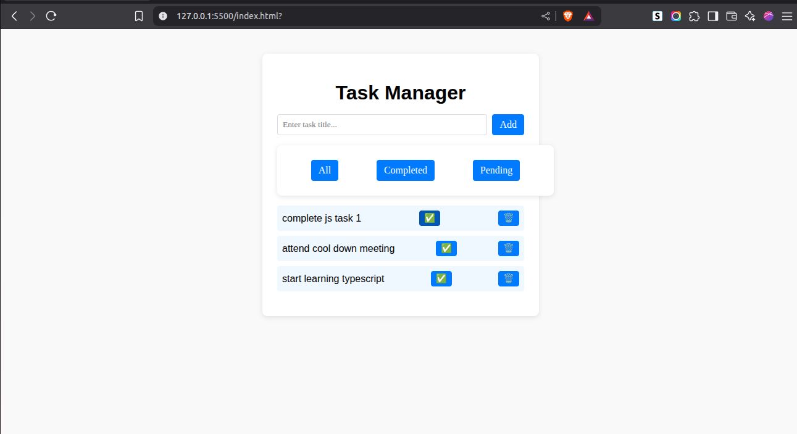
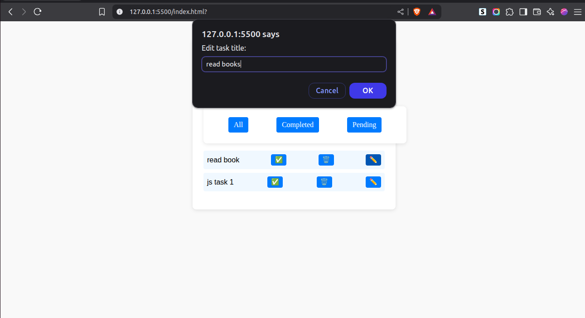
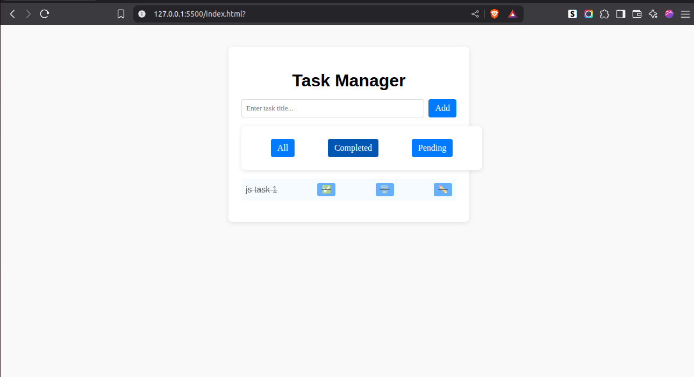

# Todo List App

This is a simple Todo List web application built using HTML, CSS, and JavaScript.

## Features

- Add new tasks  
- Edit existing tasks  
- Delete tasks  
- Tasks update dynamically on the page
- Filter completed and pending tasks

## How to Run

1. Clone the repository:
git clone https://github.com/fikante/todo-app.git

2. Open the `index.html` file in your browser.

## Screenshots

### 1. Initial Empty Page  

### 2. After Adding a Task  

### 3. After Editing a Task  

### 4. After Deleting a Task  

